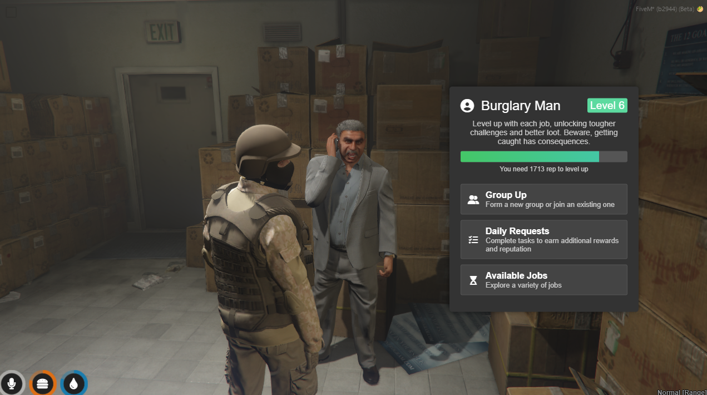
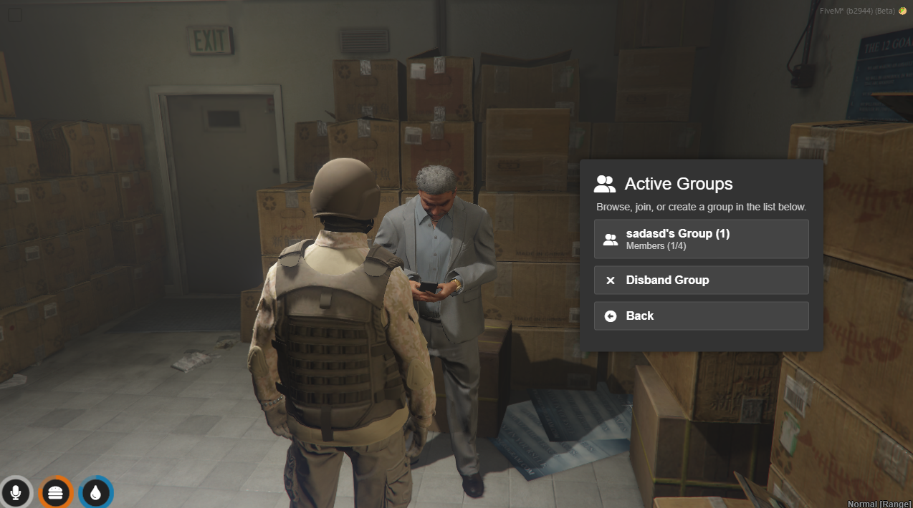
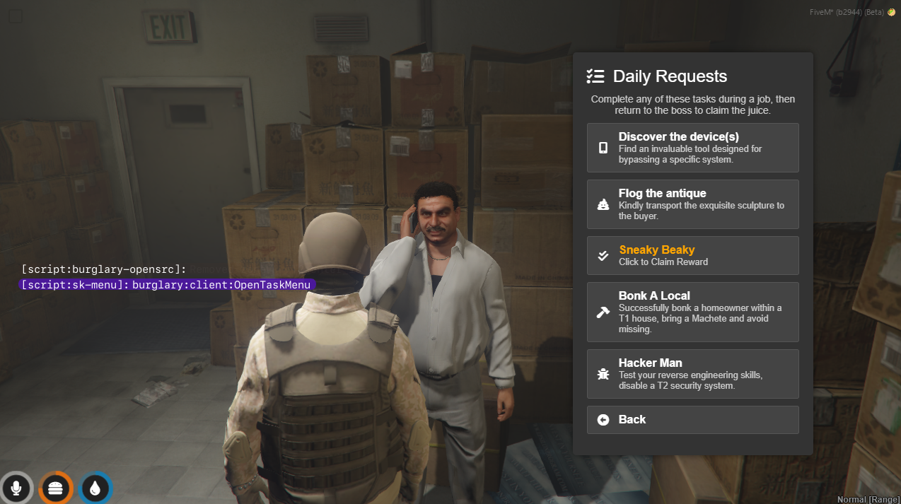
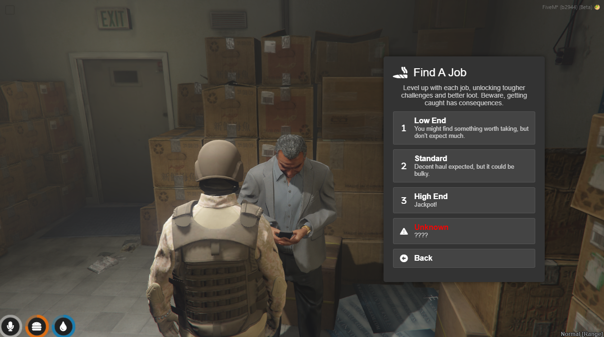
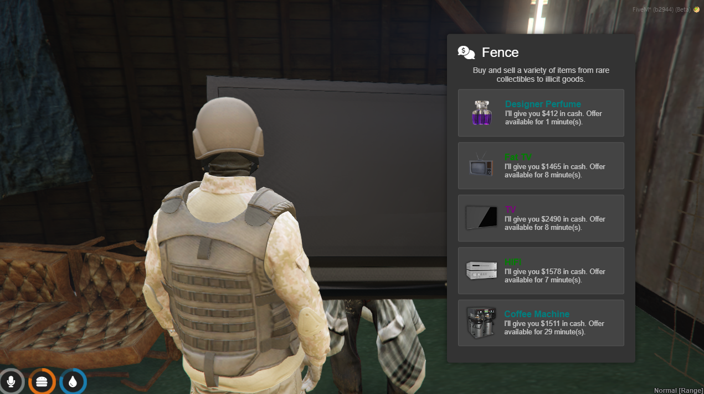

# sk-menu

Just a simple NUI menu for FiveM. It’s designed for our existing resources and will also serve as a fundamental component in our next project.

WIP

Testing this with our robbery resource












## Usage
To open a menu, call the `OpenCustomMenu` export with the desired menu data and position.

```
exports['sk-menu']:OpenCustomMenu(menuData, 'right')
```

## TODO