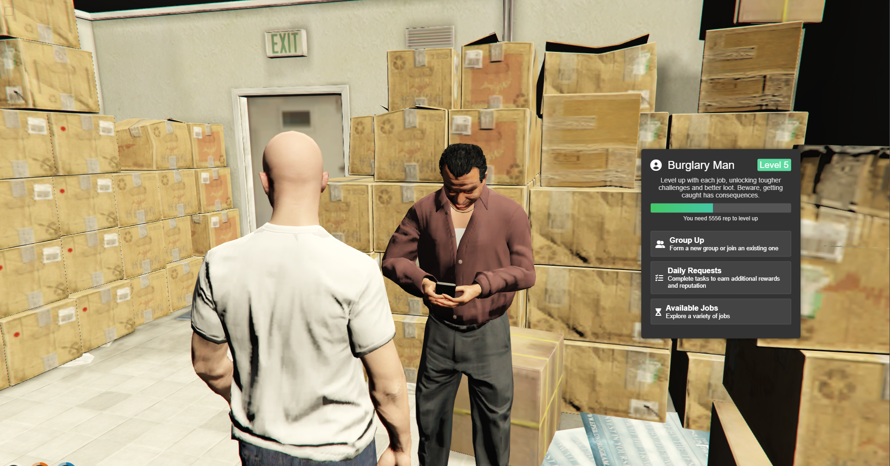
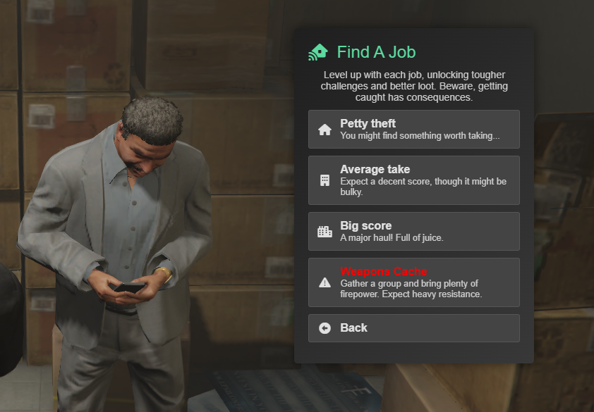
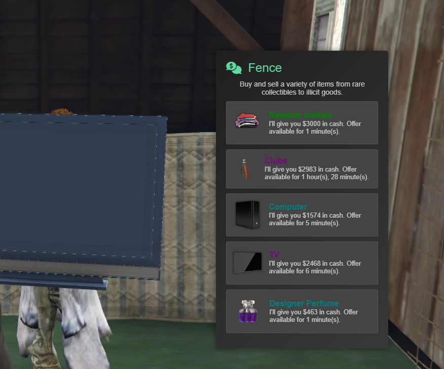

# sk-menu

Just a simple NUI menu for FiveM. It’s designed for our existing resources and will also serve as a fundamental component in our next project.







## Usage
To open a menu, call the `OpenCustomMenu` export with the desired menu data and position.

```
local menuData = {
    title = 'Test title',
    titleIcon = 'fa-solid fa-tasks',
    generalDescription = 'Test desccc',
    items = {
        {
            header = 'item title',
            description = 'item desc',
            disabled = false,
            icon = 'fa-solid fa-tasks',
            action = function()
            end,
            shouldClose = true,
            event = 'burglary:test:test',
            eventType = 'server',
            eventParams = { },
        },
    }
}
```

```
exports['sk-menu']:OpenCustomMenu(menuData, 'right')
```