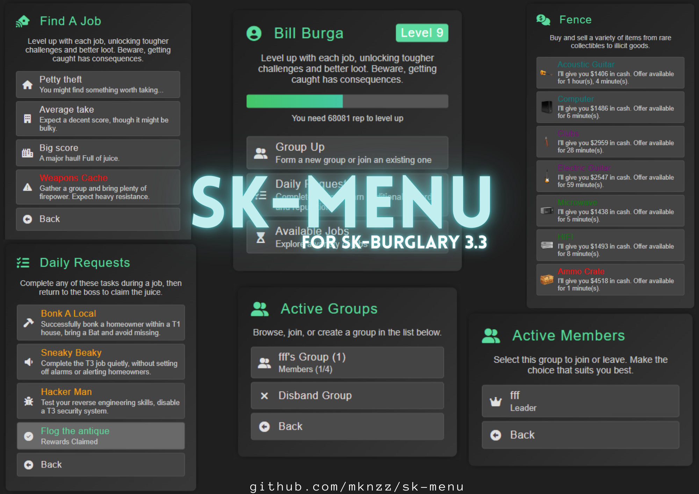

# sk-menu

A simple and clean NUI menu for FiveM, specifically designed to complement the sk-burglary script. We recommend using this menu with sk-burglary for auto refreshing, enhanced level information, and a smoother experience.



## Usage
To open a menu, call the `OpenCustomMenu` export with the desired menu data and position.

```
exports['sk-menu']:OpenCustomMenu(menuData, 'right')
```