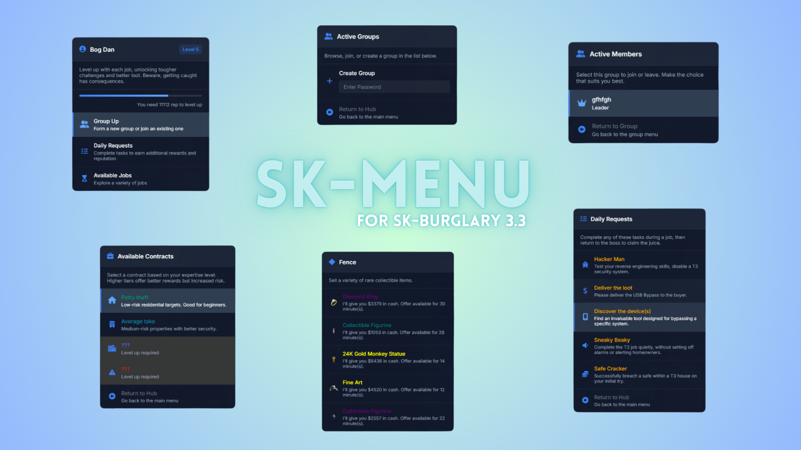

# sk-menu - FiveM NUI Menu


NUI menu for FiveM with built-in support for icons/images, textboxes, and dynamic content. Originally designed to complement sk-burglary but suitable for any FiveM resource.



## 📦 Installation
1. Download the resource
2. Place in your resources folder
3. Add `ensure sk-menu` to your server.cfg

## 🔧 Usage

### Basic Menu
```lua
local menuData = {
    title = "My Menu",
    titleIcon = "fas fa-star",
    items = {
        {
            header = "Menu Item",
            description = "This is a description",
            icon = "fas fa-check",
            event = "my:clientEvent",
            eventType = "client" -- or "server"
        }
    }
}

exports['sk-menu']:OpenCustomMenu(menuData, 'right')
```

### Menu with Actions
```lua
local menuData = {
    title = "Actions Menu",
    titleIcon = "fas fa-cog",
    items = {
        {
            header = "Execute Function",
            description = "Runs a local function",
            icon = "fas fa-play",
            action = function()
                print("Function executed!")
            end
        }
    }
}
```

### Menu with Textbox
```lua
local menuData = {
    title = "Input Menu",
    titleIcon = "fas fa-keyboard",
    items = {
        {
            header = "Enter Name",
            description = "Type your name",
            icon = "fas fa-user",
            textbox = {
                placeholder = "John Doe",
                maxLength = 30,
                event = "my:saveNameEvent",
                eventType = "client"
            }
        }
    }
}
```

### Progress/Level System
```lua
local menuData = {
    title = "Skills Menu",
    titleIcon = "fas fa-chart-line",
    levelInfo = "Level 5",
    exp = 750,
    expNext = 1000,
    xpNeeded = "250 XP until next level",
    items = {
        -- menu items
    }
}
```

## 📋 Menu Options

### Menu Properties
| Property | Type | Description |
|----------|------|-------------|
| title | string | Menu title |
| titleIcon | string | FontAwesome icon class |
| generalDescription | string | Description below title |
| levelInfo | string | Level display text |
| exp | number | Current experience points |
| expNext | number | Experience needed for next level |
| xpNeeded | string | XP requirement display text |

### Item Properties
| Property | Type | Description |
|----------|------|-------------|
| header | string | Item title |
| description | string | Item description |
| icon | string | Item icon (FontAwesome/image path) |
| event | string | Event to trigger |
| eventType | string | "client" or "server" |
| action | function | Local function to execute |
| disabled | boolean | Disables item interaction |
| color | string | Custom header color |
| shouldClose | boolean | Close menu after click |
| textbox | object | Textbox configuration |

### Textbox Properties
| Property | Type | Description |
|----------|------|-------------|
| placeholder | string | Placeholder text |
| maxLength | number | Maximum input length |
| event | string | Event for textbox value |
| eventType | string | "client" or "server" |

## 🛠️ Exports

### OpenCustomMenu
Opens a new menu
```lua
exports['sk-menu']:OpenCustomMenu(menuData, position)
-- position: "left", "right", "top", "bottom"
```

### GetInMenu
Check if specific menu is open (Fence only atm)
```lua
local isInMenu = exports['sk-menu']:GetInMenu()
```

| TODO                                                                 | Status    |
|---------------------------------------------------------------------------|-----------|
| Missing error handling for event triggers and saved functions             | ⚠️ Partial  |
| No validation of function/event data types                                | ❌ Not done |
| No cleanup of saved functions on menu close                               | ✅ Done     |
| No protection against actions after menu is closed                        | ✅ Done     |
| Add proper error handling for NUI callbacks                               | ⚠️ Partial  |
| Standardize menu data property naming and structure                       | ❌ Not done |
